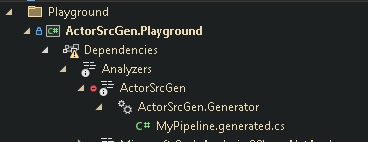

# Welcome To ActorSrcGen 
 
ActorSrcGen is a C# Source Generator that converts simple C# classes into TPL Dataflow-compatible pipelines. It simplifies working with TPL Dataflow by generating boilerplate code to handle errors without interrupting the pipeline, ideal for long-lived processes with ingesters that continually pump messages into the pipeline.


## Getting Started

1.	**Install the package**:

    ```shell
    dotnet add package ActorSrcGen
    ```

2.	**Declare the pipeline class**:

    ```csharp
    [Actor]
    public partial class MyPipeline
    {
    }
    ```

    The class must be `partial` to allow the source generator to add boilerplate code.

    If you are using Visual Studio, you can see the generated part of the code under the
    ActorSrcGen analyzer:

    

3.	**Create ingester functions**:

    ```csharp
    [Ingest(1)]
    [NextStep(nameof(DoSomethingWithRequest))]
    public async Task<string> ReceivePollRequest(CancellationToken cancellationToken)
    {
        return await GetTheNextRequest();
    }
    ```

    Ingesters define a `Priority` and are visited in priority order. If no messages are available, the pipeline sleeps for a second before retrying.

4.	**Implement pipeline steps**:

    ```csharp
    [FirstStep("decode incoming poll request")]
    [NextStep(nameof(ActOnTheRequest))]
    public PollRequest DecodeRequest(string json)
    {
        Console.WriteLine(nameof(DecodeRequest));
        var pollRequest = JsonSerializer.Deserialize<PollRequest>(json);
        return pollRequest;
    }
    ```

    The first step controls the pipeline's interface. Implement additional steps as needed, ensuring input and output types match.

1. Now **implement other steps** are needed in the pipeline.  The outputs and input types 
    of successive steps need to match.

    ```csharp
    [Step]
    [NextStep(nameof(DeliverResults))]
    public PollResults ActOnTheRequest(PollRequest req)
    {
        Console.WriteLine(nameof(ActOnTheRequest));
        var result = SomeApiClient.GetTheResults(req.Id);
        return result;
    }
    ```

5.	**Define the last step**:

    ```csharp
    [LastStep]
    public bool DeliverResults(PollResults res)
    {
        return myQueue.TryPush(res);
    }
    ```


6.	**Generated code example**:

    ```csharp
    using System.Threading.Tasks.Dataflow;
    using Gridsum.DataflowEx;

    public partial class MyActor : Dataflow<string, bool>, IActor< string >
    {

	    public MyActor(DataflowOptions dataflowOptions = null) : base(DataflowOptions.Default)
	    {
            _DeliverResults = new TransformBlock<PollResults,bool>(         (PollResults x) => {
                try
                {
                    return DeliverResults(x);
                }
                catch(Exception e)
                {
                    LogMessage(LogLevel.Error, $"Error in DeliverResults: {e.Message}\nStack Trace: {e.StackTrace}");
                    return default;
                }
            },
                new ExecutionDataflowBlockOptions() {
                    BoundedCapacity = 1,
                    MaxDegreeOfParallelism = 1
            });
            RegisterChild(_DeliverResults);

            _ActOnTheRequest = new TransformBlock<PollRequest,PollResults>(         (PollRequest x) => {
                try
                {
                    return ActOnTheRequest(x);
                }
                catch(Exception e)
                {
                    LogMessage(LogLevel.Error, $"Error in ActOnTheRequest: {e.Message}\nStack Trace: {e.StackTrace}");
                    return default;
                }
            },
                new ExecutionDataflowBlockOptions() {
                    BoundedCapacity = 1,
                    MaxDegreeOfParallelism = 1
            });
            RegisterChild(_ActOnTheRequest);

            _DecodeRequest = new TransformBlock<string,PollRequest>(         (string x) => {
                try
                {
                    return DecodeRequest(x);
                }
                catch(Exception e)
                {
                    LogMessage(LogLevel.Error, $"Error in DecodeRequest: {e.Message}\nStack Trace: {e.StackTrace}");
                    return default;
                }
            },
                new ExecutionDataflowBlockOptions() {
                    BoundedCapacity = 1,
                    MaxDegreeOfParallelism = 1
            });
            RegisterChild(_DecodeRequest);

            _ActOnTheRequest.LinkTo(_DeliverResults, new DataflowLinkOptions { PropagateCompletion = true });
            _DecodeRequest.LinkTo(_ActOnTheRequest, new DataflowLinkOptions { PropagateCompletion = true });
	        }

            TransformBlock<PollResults,bool> _DeliverResults;
            TransformBlock<PollRequest,PollResults> _ActOnTheRequest;
            TransformBlock<string,PollRequest> _DecodeRequest;
            public override ITargetBlock<string > InputBlock { get => _DecodeRequest ; }
            public override ISourceBlock< bool > OutputBlock { get => _DeliverResults; }
            public bool Call(string input) => InputBlock.Post(input);
            public async Task<bool> Cast(string input) => await InputBlock.SendAsync(input);
    
            public async Task<bool> AcceptAsync(CancellationToken cancellationToken)
            {
                try
                {
                    var result = await _DeliverResults.ReceiveAsync(cancellationToken);
                    return result;
                }
                catch (OperationCanceledException operationCanceledException)
                {
                    return await Task.FromCanceled<bool>(cancellationToken);
                }
            }

          public async Task Ingest(CancellationToken ct)
          {
            // start the message pump
            while (!ct.IsCancellationRequested)
            {
              var foundSomething = false;
              try
              {
                // cycle through ingesters IN PRIORITY ORDER.
                {
                    var msg = await ReceivePollRequest(ct);
                    if (msg != null)
                    {
                        Call(msg);
                        foundSomething = true;
                        // then jump back to the start of the pump
                        continue;
                    }
                }

                if (!foundSomething) 
                    await Task.Delay(1000, ct);
              }
              catch (TaskCanceledException)
              {
                // if nothing was found on any of the receivers, then sleep for a while.
                continue;
              }
              catch (Exception e)
              {
                LogMessage(LogLevel.Error, $"Exception in Ingest loop: {e.Message}\nStack Trace: {e.StackTrace}");
              }
            }
          }
        }
    ```


7.	**Using the pipeline**:

    ```csharp
    var actor = new MyActor(); // this is your pipeline

    try
    {
        // call into the pipeline synchronously
        if (actor.Call("""
                       { "something": "here" }
                       """))
            Console.WriteLine("Called Synchronously");

        // stop the pipeline after 10 secs
        var cts = new CancellationTokenSource(TimeSpan.FromSeconds(10));

        // kick off an endless process to keep ingesting input into the pipeline
        var t = Task.Run(async () => await actor.Ingest(cts.Token), cts.Token);

        // consume results from the last step via the AcceptAsync method
        while (!cts.Token.IsCancellationRequested)
        {
            var result = await actor.AcceptAsync(cts.Token);
            Console.WriteLine($"Result: {result}");
        }

        await t; // cancel the message pump task
        await actor.SignalAndWaitForCompletionAsync(); // wait for all pipeline tasks to complete
    }
    catch (OperationCanceledException _)
    {
        Console.WriteLine("All Done!");
    }
    ```


## Benefits
- Simplifies TPL Dataflow usage: Automatically generates boilerplate code.
- Concurrency: Efficient use of multiple CPU cores.
- Fault tolerance: Errors in pipeline steps are trapped and handled.
- Encapsulation: Easier to reason about and test code.

## Testing
- Run the suite: `dotnet test`
- With coverage (85% threshold, critical paths 100%): `dotnet test /p:CollectCoverage=true /p:CoverletOutputFormat=cobertura`
- See quickstart for full workflow: [specs/001-generator-reliability-hardening/quickstart.md](specs/001-generator-reliability-hardening/quickstart.md)

## Diagnostics
- ASG0001 Non-disjoint input types: ensure entry steps have distinct input signatures
- ASG0002 Missing input types: add at least one [FirstStep] or [Step] method
- ASG0003 Generation error: inspect the diagnostic message for the underlying exception
- Full reference: [doc/DIAGNOSTICS.md](doc/DIAGNOSTICS.md)


## Acknowledgements

Built on [DataflowEx](https://github.com/gridsum/DataflowEx) and [Bnaya.SourceGenerator.Template](https://github.com/bnayae/Bnaya.SourceGenerator.Template).
